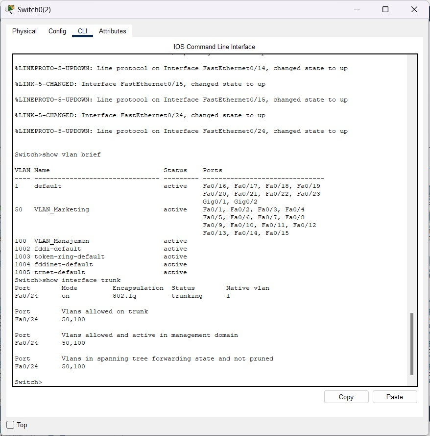
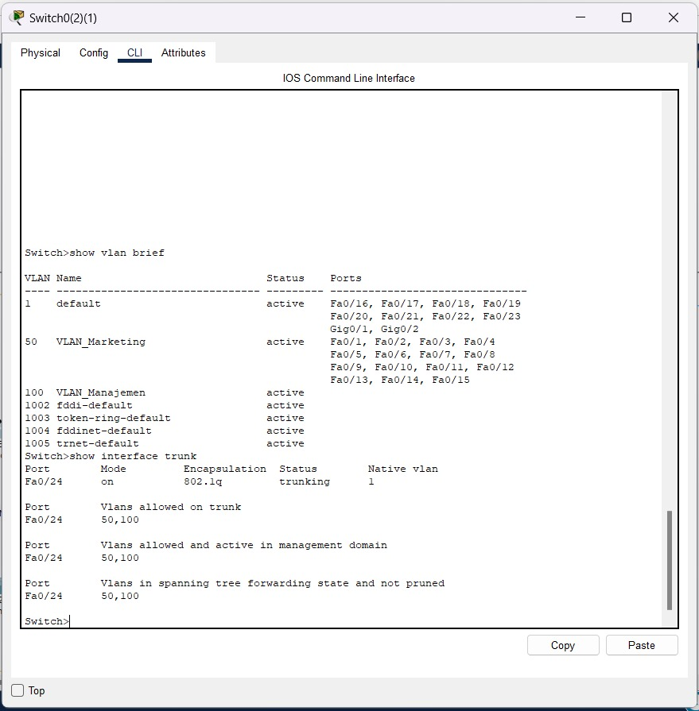
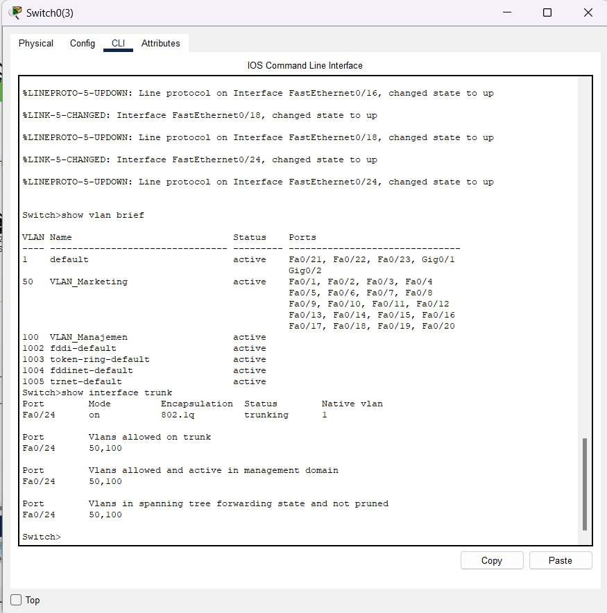
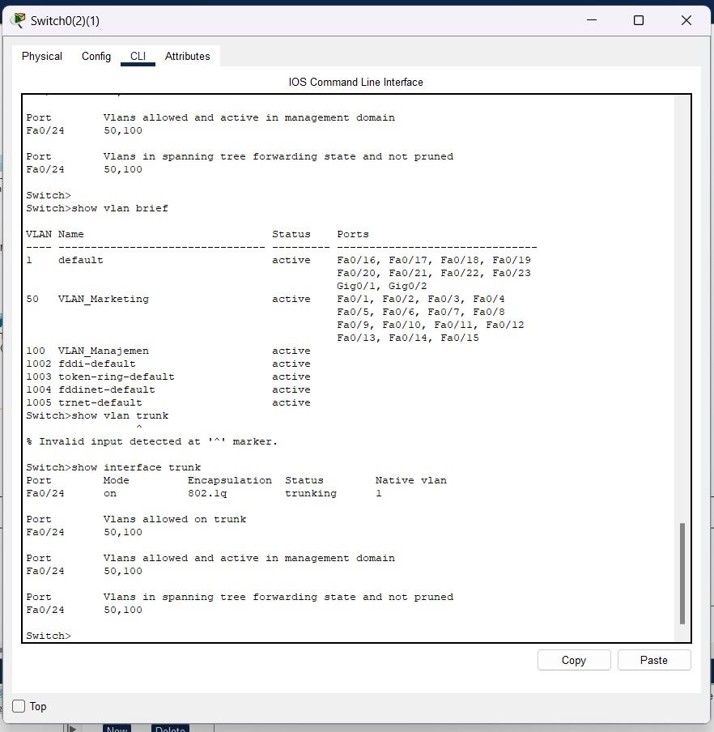
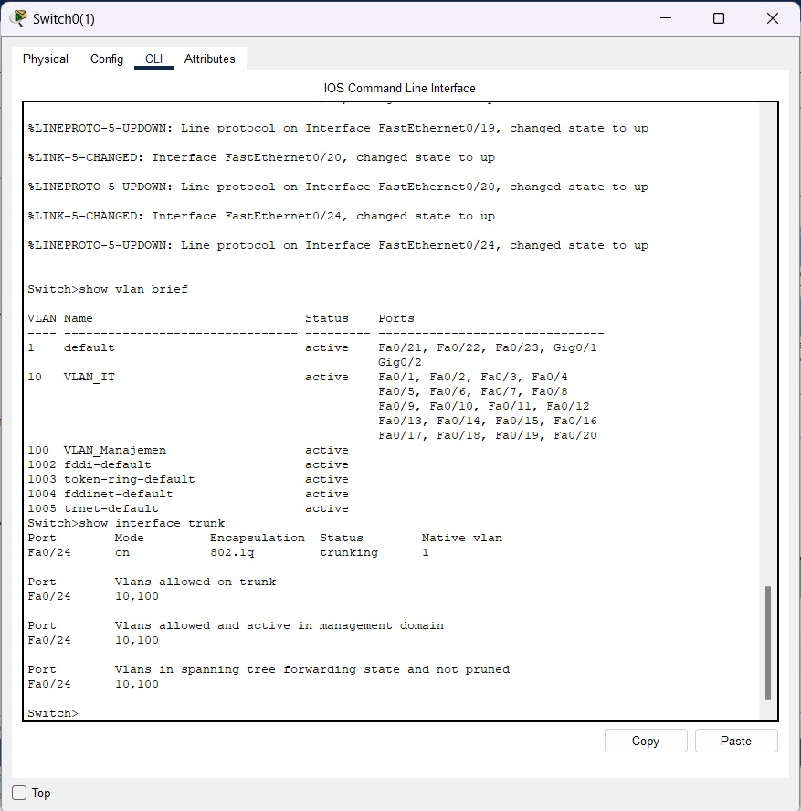
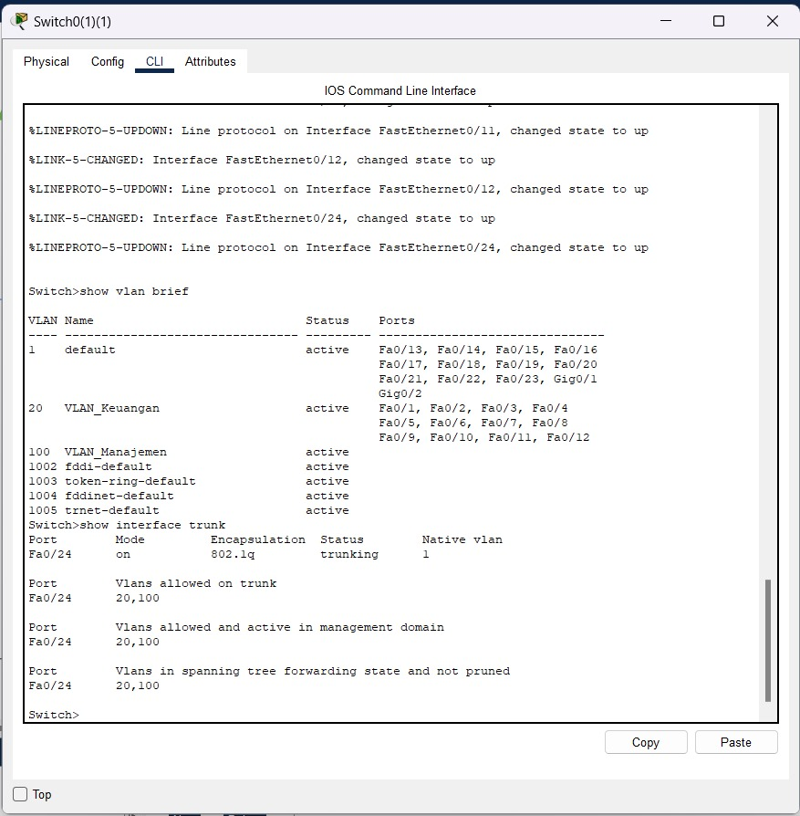
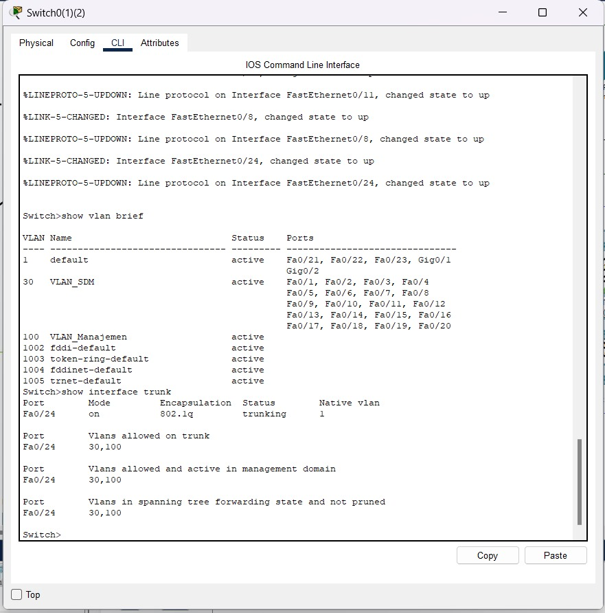

**Dokumen Perencanaan Proyek: Perancangan Topologi Jaringan Enterprise PT. Nusantara Network**

**Disusun oleh Kelompok [12]:**

1.  **Risky Nur Fatimah Bahar** - Network Architect
2.  **Anjas Geofany Diamare** - Network Engineer
3.  **Ahmad Daffa Alfattah** - Network Services Specialist
4.  **Dzakwan Fatih Fadhilah** - Security & Documentation Specialist

**Tanggal Pengumpulan:** Jumat, [Pekan 11], [2025]

---
**Daftar Isi**

1. Pembangunan Topologi Dasar 
    1.1 Link File Simulasi 

2. Konfigurasi VLAN dan Trunking 
    2.1 Konfigurasi VLAN pada Switch dan Konfigurasi Trunk 
    2.2 Dokumentasi Lengkap Konfigurasi CLI 

3. Implementasi Routing antar-VLAN 
    3.1 Konfigurasi Router untuk Inter-VLAN Routing 
    3.2 Penjelasan Skema Routing 

4. Pengujian dan Hasil 
    4.1 Screenshot Hasil Pengujian 
    4.2 Analisis Hasil Konektivitas 

---
**1. Pembangunan Topologi Dasar** 
**1.1 Link File Simulasi**
[LinkPKT]<src="https://github.com/Kelompok12Cess/Tubes/tree/main/Pekan%2011">

**2. Konfigurasi VLAN dan Trunking** 
**2.1 Konfigurasi VLAN pada Switch dan Konfigurasi Trunk**
- Departemen IT 
VLAN 10 = VLAN_Manajemen
Interface range fa0/1-20
Interface fa0/24

- Departemen Keuangan 
VLAN 20 = VLAN_Keuangan
Interface range fa0/1-12
Interface fa0/24

- Departemen SDM 
VLAN 30 = VLAN_SDM
Interface range fa0/1-20
Interface fa0/24

- Departemen Operasional 
VLAN 50 = VLAN_Marketing
Interface range fa0/1-15
VLAN 100 = VLAN_Manajemen
Interface fa0/24 
VLAN 50 = VLAN_Marketing
Interface range fa0/1-20
VLAN 100 = VLAN_Manajemen
Interface fa0/24

- Departemen Marketing
VLAN 50 = VLAN_Marketing
Interface range fa0/1-15
VLAN 100 = VLAN_Manajemen
Interface fa0/24

**2.2 Dokumetasi Lengkap Konfigurasi CLI**
- Departemen IT

- Departemen Keuangan

- Departemen SDM

- Departemen Operasional

- Departemen Marketing

- Switch Farm

- Switch Cabang

**3. Implementasi Routing antar-VLAN** 
**3.1 Konfigurasi Router untuk Inter-VLAN Routing**

**3.2 Penjelasan Skema Routing** 
Konfigurasi yang dilakukan yaitu Konfigurasi Inter-VLAN routing menggunakan metode Router-on-a-Stick, di mana suatu interface fisik fa0/0 di router dibagi menjadi beberapa subinterface seperti fa0/0.10, fa0/0.20, hingga fa0/0.100. Masing-masing subinterface dikonfigurasi dengan encapsulation dot1Q untuk VLAN tertentu dan diberikan IP address sebagai gateway VLAN tersebut. Interface utama fa0/0 diaktifkan *no shutdown* agar semua subinterface bisa aktif dan siap digunakan untuk routing antar VLAN di jaringan.

**4. Pengujian dan Hasil** 
**4.1 Screenshot Hasil Pengujian**
- Departemen Marketing

- Departemen Operasional

- Departemen IT

- Departemen Keuangan

- Departemen SDM

**4.2 Analisis Hasil Konektivitas**
Keempat switch memiliki VLAN yang berbeda-beda: Switch0 menggunakan VLAN 10 (IT), Switch0(1) menggunakan VLAN 20 (Keuangan), sedangkan Switch0(2) dan Switch0(3) menggunakan VLAN 50 (Marketing). Semua switch menggunakan port Fa0/24 sebagai trunk dengan mode 802.1q, namun VLAN yang diizinkan di trunk tidak konsisten. Hal ini menyebabkan komunikasi antar switch untuk VLAN 10 dan 20 tidak bisa terjadi karena VLAN tersebut tidak diizinkan di trunk switch lain. Hanya VLAN 50 yang dapat terkoneksi dengan baik antara Switch0(2) dan Switch0(3). VLAN 100 (Manajemen) tersedia dan diizinkan di semua switch, sehingga kemungkinan koneksi manajemen berjalan lancar. Untuk konektivitas penuh, konfigurasi trunk perlu diselaraskan.

**Kendala**
Terdapat salah pemasangan kabel di Departemen Keuangan, sehingga melakukan pemasangan ulang kabel untuk di departemen tersebut.

**Kesimpulan**
Setiap departemen memiliki VLAN yang di mana untuk terhubung ke PC dengan VLAN berbeda.